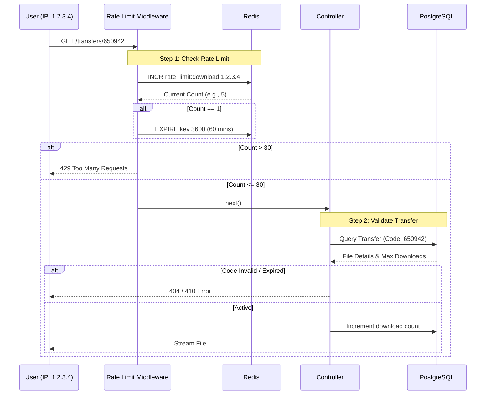

# FileFly System Flow & Logic Documentation

This document details the architectural flow and logic behind the FileFly file sharing application, specifically focusing on the rate limiting implementation.

## 1. System Overview

FileFly allows anonymous users to upload a file and receive a 6-digit code. Another user can use this code to download the file. To prevent abuse, the system limits the number of downloads per IP address.

### Key Components
- **Frontend**: Simple HTML/JS interface for file selection and code entry.
- **Backend**: Node.js + Express API.
- **Database**: PostgreSQL (stores file metadata and transfer codes).
- **Cache/Rate Limiter**: Redis (tracks download counts by IP).

---

## 2. High-Level Flow

### A. Upload Flow (Sender)
1. User selects a file.
2. Frontend sends `POST` request to `/api/transfers/upload`.
3. Backend:
    - Stores file on disk.
    - Saves metadata to PostgreSQL (`files` table).
    - Generates a 6-digit code.
    - Saves transfer details (`transfers` table) with `max_downloads=100`.
4. Backend returns the **Transfer Code**.

### B. Download Flow (Receiver)
1. User enters the 6-digit code.
2. Frontend sends `GET` request to `/api/transfers/:code`.
3. **Middleware**: Checks Redis for Rate Limit (30 downloads/60mins).
    - *If limit exceeded*: Returns `429 Too Many Requests`.
    - *If allowed*: Increments count in Redis and proceeds.
4. Backend Controller:
    - Validates code in PostgreSQL.
    - Checks expiration (10 mins) and remaining download attempts.
    - Streams file to user.

---

## 3. Logic & Diagrams

### Sequence Diagram: Download & Rate Limiting



### Flowchart: Visual Logic

```mermaid
flowchart TD
    Start[User Requests Download] --> Middleware{Rate Limit Check}
    
    Middleware -->|Count > 30| Block[Block Request (429)]
    Middleware -->|Count <= 30| Controller[Process Request]
    
    Controller --> DB{Check Database}
    DB -->|Code Not Found| Error404[Return 404]
    DB -->|Expired| Error410[Return 410 Link Expired]
    DB -->|Valid| Stream[Stream File]
    
    Block --> End[End]
    Error404 --> End
    Error410 --> End
    Stream --> End
```

---

## 4. Detailed Logic Breakdown

### 1. The Rate Limiter (Redis)
**Logic**: We use the "Leaky Bucket" or "Fixed Window" counter approach.
- **Key**: We create a unique key for every user based on their IP: `rate_limit:download:<USER_IP>`.
- **Increment**: Every time a user *attempts* a download, we increment this counter in Redis.
- **Expiration**: The first time the key is created, we set it to self-destruct (expire) in 60 minutes.
- **Decision**:
    - If the counter is **<= 30**, let them pass.
    - If the counter is **> 30**, stop them immediately (save DB resources).

### 2. The Database (PostgreSQL)
**Logic**: We split data into `files` (permanent-ish metadata) and `transfers` (temporary access logic).
- `files`: Stores `original_name`, `size`, `mime_type`.
- `transfers`: Stores the `transfer_code` (e.g., 650942), `expires_at`, and `max_downloads`.
- **Why split?**: Allows potential future features where one file could have multiple transfer links with different settings.

### 3. File Security
- Files are stored on disk with random names (UUIDs) so people can't guess filenames.
- Only a valid database entry maps the random storage name back to the original filename for the user.
