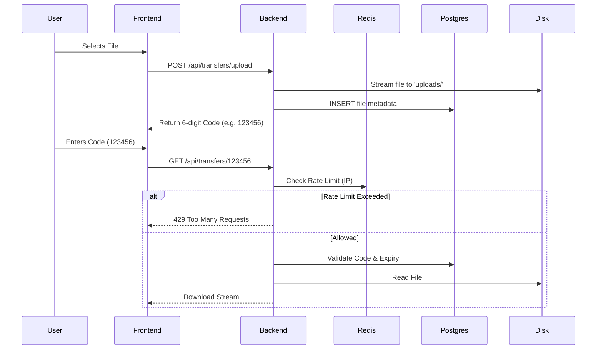

# Interview Deep Dive: FileFly System Architecture

This document breaks down the exact flow of the FileFly application, explaining **what** happens, **how** it works (with code), and **why** we made those decisions. Use this to demonstrate deep understanding during your interview.

---

## 1. High-Level Architecture

We built a **3-Tier Architecture**:
1.  **Frontend**: Vanilla JS (Lightweight, no framework overhead).
2.  **Backend**: Node.js + Express (Fast I/O for file streaming).
3.  **Data Layer**:
    *   **PostgreSQL**: Persistent storage for file metadata.
    *   **Redis**: In-memory store for high-speed rate limiting.
    *   **Local Filesystem**: Actual file storage (`uploads/`).



---

## 2. Phase 1: The Upload Flow

### The Logic
**Goal:** Receive a file, save it securely, and give the user a short code to retrieve it.

**Step-by-Step:**
1.  **Frontend**: User picks a file. We use `FormData` to package it as a `multipart/form-data` request.
2.  **Backend (Middleware)**: We use `multer` to intercept the incoming stream. It saves the file to disk *before* our controller runs.
    *   *Why?* It handles the binary stream efficiently so we don't have to parse raw bytes manually.
3.  **Backend (Controller)**:
    *   Generate a random 6-digit code.
    *   Save metadata (Original Name, Stored Filename, Size) to Postgres.
    *   Return code to user.

### The Code
**Frontend (`script.js`):**
```javascript
const formData = new FormData();
formData.append('file', file); // binary attachment

await fetch('/api/transfers/upload', {
    method: 'POST',
    body: formData // Browser sets Content-Type automaticallly
});
```

**Backend (`transfer.controller.js`):**
```javascript
// 1. Multer saves file first
const upload = multer({ dest: "uploads/" });

// 2. We use transactions (implicitly) to ensure data integrity
const fileResult = await pool.query(
    `INSERT INTO files (original_name, stored_name, mime_type, size) VALUES ($1,$2,$3,$4) RETURNING id`
);
// 3. Link unique code to file ID
await pool.query(
    `INSERT INTO transfers (file_id, transfer_code, expires_at, max_downloads) VALUES ($1,$2,$3,$4)`
);
```

### 🛑 Interview Challenge: "The 100MB Git Disaster"
**Interviewer:** "What was a difficult problem you faced?"
**You:** "Actually, the upload feature caused a major deployment issue. I was testing with large 100MB+ videos locally. When I tried to push my code to GitHub, it was rejected because I accidentally committed the `uploads/` folder.
I learned that **Git stores history**, not just files. Even after deleting the file, it was stuck in the commit history. I had to use `git reset --soft` and `git gc --aggressive` to clean the repository. It taught me the hard way to configure `.gitignore` *first*."

---

## 3. Phase 2: Rate Limiting (Middle Layer)

### The Logic
**Goal:** Prevent abuse. We don't want bots downloading 10,000 files/second and crashing the server.

**Why Redis?**
*   Postgres is slow for counters (disk I/O).
*   Redis is **in-memory** and atomic. `INCR` operations take microseconds.

**Mechanism:** "Token Bucket" style.
*   Key: `rate_limit:download:<USER_IP>`
*   Logic: If (count > 30) => Block. Else => Allow & Increment.

### The Code
**Backend (`rateLimiter.js`):**
```javascript
const key = `rate_limit:download:${ip}`;

// Atomic increment - race-condition free
const currentCount = await redis.incr(key); 

if (currentCount === 1) {
    // Set expiry only on first request (Rolling window)
    await redis.expire(key, 3600); 
}

if (currentCount > 30) {
    return res.status(429).json({ error: "Too many requests" });
}
```

### 🛑 Interview Challenge: "Why not use a JS Set?"
**Interviewer:** "Why did you add Redis? Couldn't you just use a Javascript variable?"
**You:** "I could have used a simple `Map` in memory, but that has two problems:
1.  **Persistence**: If the server restarts, all rate limits reset.
2.  **Scaling**: If I scale to 2 server instances (for load balancing), a local variable doesn't share state. User A could download 30 files from Server 1 and 30 from Server 2. Redis provides a **centralized** state store for all instances."

---

## 4. Phase 3: The Download Flow

### The Logic
**Goal:** validate the code, minimize database hits, and securely deliver the file.

**Step-by-Step:**
1.  **Frontend**: User sends GET request with the code.
2.  **Backend**:
    *   **Rate Limit Check**: (Redis) Happens *before* DB query to save resources.
    *   **DB Lookup**: Find file by code. Check usage logic (`is_active`, `expires_at`).
    *   **Update Stats**: Increment download count. Deactivate if limit reached.
    *   **Stream File**: Use `res.download` or `res.sendFile`.

### The Code
**Backend (`transfer.controller.js`):**
```javascript
// 1. Join Tables to get File + Transfer info
const result = await pool.query(
  `SELECT f.*, t.* FROM transfers t
   JOIN files f ON t.file_id = f.id
   WHERE t.transfer_code = $1`, [code]
);

// 2. Logic Checks
if (new Date() > transfer.expires_at) return res.status(410);

// 3. Security: Prevent Path Traversal
// We don't trust user input for paths. We use the ID from DB.
const filePath = path.resolve(`uploads/${transfer.stored_name}`);

// 4. Set Headers so browser treats it as a file download
res.setHeader('Content-Disposition', `attachment; filename="${transfer.original_name}"`);
res.sendFile(filePath);
```

### 🛑 Interview Challenge: "Handling Special Characters"
**Interviewer:** "What happens if a file is named `Resume "Final".pdf`?"
**You:** "That broke my download initially! The quotes in the filename broke the HTTP header.
I had to implement **RFC 5987** encoding.
I used `encodeURIComponent` and set the `filename*` parameter in `Content-Disposition`. This ensures special characters (emojis, quotes, spaces) work across all browsers."

---

## Summary for the Interview

If asked **"Tell me about this project"**, structure it this way:

1.  **The Hook**: "I built a transient file sharing service like WeTransfer. It solves the problem of quick, anonymous file sharing."
2.  **The Tech**: "I chose Node.js for streaming performance, Postgres for structured metadata, and Redis for high-speed rate limiting."
3.  **The specific challenge**: "The hardest part was ensuring reliability. I had to implement IP-based rate limiting using Redis to prevent abuse, and I had to dive deep into Git internals when binary files bloated my repo size."
